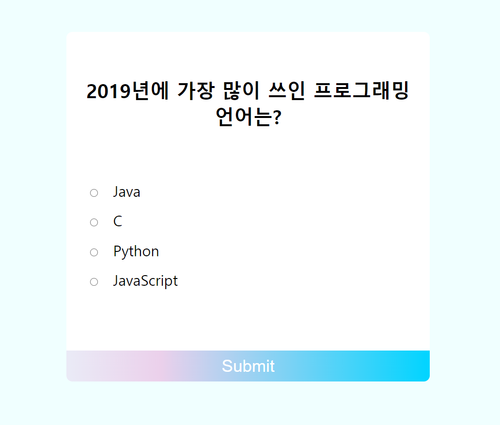
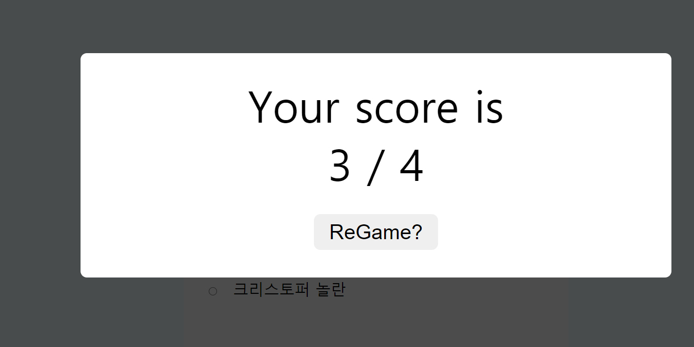

# Quiz-App
 
<ol>
  <li><strong>프로젝트 이름</strong> : Quiz-App</li>
  <li><strong>사용 언어</strong> : HTML, CSS, Vanila Javascript</li>
  <li><strong>주요 기능</strong> 
    <ul>
      <li><strong>퀴즈 진행: </strong>4지선다형으로 총 4가지의 문제를 풀게됩니다. submit버튼을 클릭하면 답변을 제출하고, 다음 문제로 넘어갑니다.</li>
      <li><strong>채점: </strong>4개의 문제를 모두 풀게되면 맞힌 정답의 개수를 알려줍니다. Regame버튼을 눌러 다시 풀 수 있습니다.</li>
    </ul>
   </li> 
  <li><strong>배운점</strong>: 
    <ul>
    <li> fetch는 비동기니까, 그 연산 순서에 유의하자. (fetch가 완료되기 전에 그 바로 아랫줄 연산이 먼저 완료될 수도 있음)</li>
    <li> radio, checkbox 등의 input type에서, check 여부를 확인하려면, input.checked를하자. 그럼 boolean값이 도출됨.</li>
    </ul>
   </li>
  </ol>

   
   
  <h5> 메인 화면 </h5>
   
  
  <h5> 채점화면 </h5>
   
  
     
